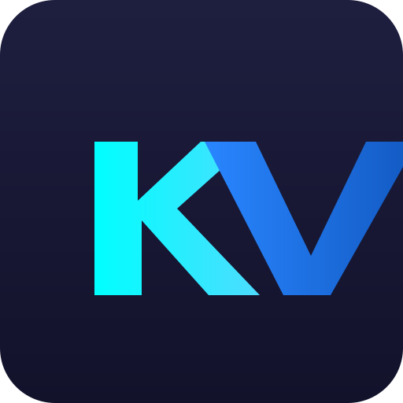

<p align="center">
  
</p>

<h1 align="center">Kent Vuong — Portfolio</h1>

<p align="center">
  Portfolio for Kent Vuong (a.k.a. Mooshieblob on GitHub) — a creative AI toolmaker building
  generative-AI tools that artists actually enjoy using. Built with SvelteKit and Tailwind CSS,
  deployed on Cloudflare Pages.
</p>

## Features

- Responsive mobile-first design
- Mooshie Yellow branding on near-black, lifted from the MooshieUI design system.
  The accent is rationed: it marks things that are **interactive or live** (primary
  buttons, links, hover and active states, the scroll beam, packets moving through
  the node graph) and nothing else. Structural marks — HUD brackets, section
  indices, hairlines — use the neutral `--line` / `--line-strong` tokens.
- Compact hero with a hairline telemetry strip, so the work grid starts above the fold
- Animated ComfyUI node-graph canvas in the hero, plus drifting gradient orbs
- `ctrl+k` command palette (rofi) and a `ctrl+\`` terminal overlay
- Smooth scrolling via [Lenis](https://github.com/darkroomengineering/lenis) on Chromium, native CSS smooth scroll on Firefox
- Bento-style project showcase grid
- Live "currently tinkering on" repo grid, pulled from the GitHub API
- Email obfuscation to prevent scraping by bots
- Cloudflare Web Analytics

## Tech Stack

- **Framework**: SvelteKit
- **Styling**: Tailwind CSS
- **Smooth Scroll**: Lenis (Chromium) / native CSS (Firefox)
- **Deployment**: Cloudflare Pages
- **Analytics**: Cloudflare Web Analytics

## Runtime Requirements

- Node.js `>= 22.14.0`
- pnpm `>= 10.32.1`

## Project Structure

```
ktvuong/
├── src/
│   ├── lib/components/    # Header, Footer, Hero, NodeGraph
│   ├── lib/data/          # Featured projects, skills, GitHub fetcher
│   ├── routes/
│   │   ├── +layout.svelte # Lenis init, global layout
│   │   └── +page.svelte   # Main page (about, tools, repos, skills, contact)
│   ├── app.css            # Global styles, tool-window chrome, animations
│   └── app.html           # HTML template
├── static/
│   ├── favicon.svg        # KV gradient logo
│   ├── emailProtection.js # Email obfuscation script
│   └── site*img/          # Project thumbnails
├── svelte.config.js
├── vite.config.ts
└── package.json
```

## Email Obfuscation

The site uses a custom email obfuscation system to protect against harvesting bots:

- XOR cipher encodes the email address in HTML
- Client-side JavaScript decodes it only when needed
- No plain text email addresses in source code or DOM

## License

MIT

## Contact

Kent Vuong — [GitHub](https://github.com/Mooshieblob1) · [LinkedIn](https://www.linkedin.com/in/kentvuong88/)
